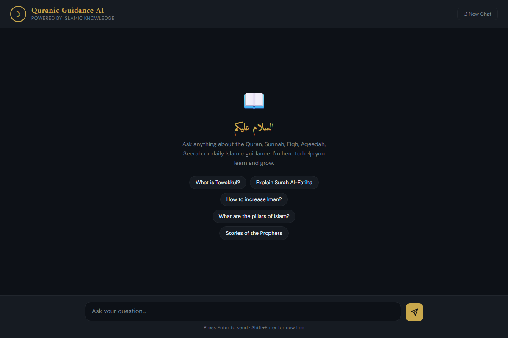
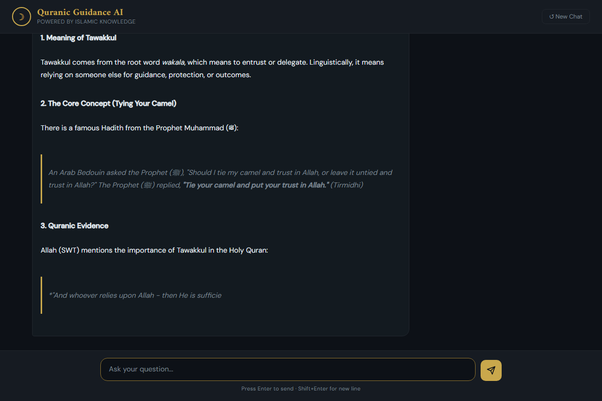

# Quranic Guidance AI

A conversational Islamic knowledge assistant with a clean dark-themed web UI, powered by **LLaMA 3** via OpenRouter. Ask questions about the Quran, Sunnah, Fiqh, Aqeedah, Seerah, and more — with full conversation memory per session.

---

## Screenshots

### Welcome Landing Page


### Conversation Interface with Markdown Rendering


---

## Features

- Beautiful dark web UI with gold Islamic aesthetic
- Markdown rendering (bolding, headers, lists, quotes, Quranic verses) for rich AI responses
- Typewriter effect on AI responses
- Full conversation memory (context carries across the whole chat)
- "New Chat" button to reset the session
- Quick-start suggestion buttons
- API key config falls back to environment variables
- Core web application contained in `app.py`

---

## Requirements

- Python 3.8 or higher
- An [OpenRouter](https://openrouter.ai) account and API key

---

## Setup

**1. Clone or download the project**

```bash
git clone https://github.com/yourname/quran-guidance-ai.git
cd quran-guidance-ai
```

**2. Install dependencies**

```bash
pip install flask openai
```

**3. Add your API key**

You can configure the API key in two ways:

- **Environment Variable (Recommended)**:
  Set the `OPENROUTER_API_KEY` environment variable in your shell:
  ```bash
  # Linux/macOS
  export OPENROUTER_API_KEY="your_api_key_here"

  # Windows PowerShell
  $env:OPENROUTER_API_KEY="your_api_key_here"
  ```

- **Edit app.py Directly**:
  Open `app.py` and find this line near the top:
  ```python
  api_key = os.environ.get("OPENROUTER_API_KEY") or "YOUR_API_KEY_HERE"
  ```
  Replace `YOUR_API_KEY_HERE` with your actual OpenRouter API key. You can get one at [openrouter.ai/keys](https://openrouter.ai/keys).

**4. Run the app**

```bash
python app.py
```

**5. Open in your browser**

```
http://127.0.0.1:5000
```

---

## Project Structure

```
quran-guidance-ai/
│
├── screenshots/
│   ├── welcome.png       # Screenshot of the landing/welcome screen
│   └── chat_demo.png     # Screenshot of the chat session displaying formatted Markdown
│
├── app.py                # Flask backend + embedded HTML frontend (main application)
├── agent.py              # Command-line version of the assistant
├── take_screenshots.py   # Utility script to automate screenshot capture using Playwright
├── LICENSE               # MIT License      
└── README.md
```

No templates or static folder needed — the entire web UI is embedded directly inside `app.py` as a string template.

---

## How It Works

```
Browser  ──POST /chat──▶  Flask (app.py)  ──▶  OpenRouter API  ──▶  LLaMA 3
                                ◀── JSON reply ◀──────────────────────────
```

- The browser sends the user's message and a session ID to `/chat`
- Flask looks up the conversation history for that session ID
- The full history is sent to the model on every request (this is how memory works)
- The model's reply is returned to the browser and typed out character by character

---

## Changing the AI Model

Find this line in `app.py`:

```python
MODEL = "meta-llama/llama-3-8b-instruct"
```

You can swap it for any model available on OpenRouter, for example:

| Model | String |
|---|---|
| LLaMA 3 8B (default) | `meta-llama/llama-3-8b-instruct` |
| LLaMA 3 70B (smarter) | `meta-llama/llama-3-70b-instruct` |
| Mistral 7B | `mistralai/mistral-7b-instruct` |
| GPT-4o | `openai/gpt-4o` |

Full model list at [openrouter.ai/models](https://openrouter.ai/models).

---

## Customizing the System Prompt

The AI's personality and scope are defined by `SYSTEM_PROMPT` in `app.py`. Edit it to change the tone, restrict topics, add a name, or expand the knowledge areas covered.

---

## Notes

- Memory is **session-only** — it resets when you restart the Flask server or click "New Chat"
- Each browser tab gets its own independent session
- The app runs locally on your machine; nothing is stored or sent anywhere except to OpenRouter
